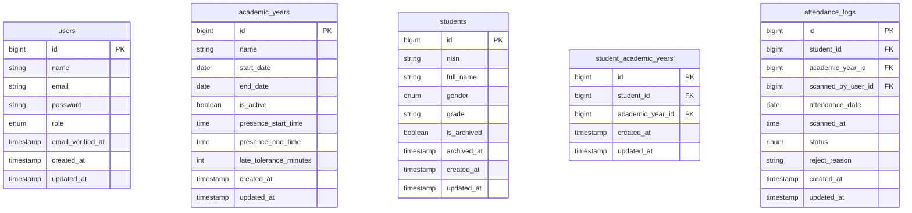

# DATABASE.md: DzuhurScan

## 1. Arsitektur Data

DzuhurScan menggunakan skema arsip *soft delete* untuk menangani pergantian tahun ajaran. Setiap siswa terikat pada satu tahun ajaran melalui relasi `StudentAcademicYear`. Saat tahun ajaran baru diimpor, siswa lama ditandai `archived` (bukan dihapus) sehingga data historis presensi tetap utuh. Skema ini memastikan integritas referensial antara presensi, siswa, dan tahun ajaran aktif.

## 2. ERD



### Relasi Kunci
- `users` 1—N `attendance_logs` (scanned_by_user_id)
- `academic_years` 1—N `student_academic_years`
- `academic_years` 1—N `attendance_logs`
- `students` 1—N `student_academic_years`
- `students` 1—N `attendance_logs`
- `student_academic_years` N—1 `academic_years` dan N—1 `students`

## 3. Definisi Tabel

### 3.1 Tabel `users`

Menyimpan akun pengguna untuk ketiga role: `ADMIN`, `PETUGAS`, `KEPALA`. Autentikasi dikelola Laravel Breeze (session-based).

| Kolom | Tipe | Constraint | Keterangan |
|:---|:---|:---|:---|
| id | BIGINT | PK, auto-increment | |
| name | VARCHAR(100) | NOT NULL | Nama lengkap pengguna |
| email | VARCHAR(191) | UK, NOT NULL | Login credential |
| password | VARCHAR(255) | NOT NULL | Hash bcrypt |
| role | ENUM('ADMIN','PETUGAS','KEPALA') | NOT NULL | Role-based access |
| email_verified_at | TIMESTAMP | NULL | Standar Breeze |
| created_at | TIMESTAMP | NULL | |
| updated_at | TIMESTAMP | NULL | |

**Index**: `idx_users_email` (UNIQUE) pada kolom `email`.

### 3.2 Tabel `academic_years`

Menyimpan tahun ajaran beserta konfigurasi jendela waktu presensi harian (FR-05) dan toleransi keterlambatan.

| Kolom | Tipe | Constraint | Keterangan |
|:---|:---|:---|:---|
| id | BIGINT | PK, auto-increment | |
| name | VARCHAR(20) | UK, NOT NULL | Contoh: "2025/2026" |
| start_date | DATE | NOT NULL | Tanggal mulai tahun ajaran |
| end_date | DATE | NOT NULL | Tanggal akhir tahun ajaran |
| is_active | BOOLEAN | NOT NULL, default false | Tahun ajaran yang digunakan presensi |
| presence_start_time | TIME | NOT NULL | Awal jendela waktu, contoh 11:45 |
| presence_end_time | TIME | NOT NULL | Akhir jendela waktu, contoh 12:30 |
| late_tolerance_minutes | INT | NOT NULL, default 0 | Menit toleransi setelah start_time untuk status TERLAMBAT |
| created_at | TIMESTAMP | NULL | |
| updated_at | TIMESTAMP | NULL | |

**Index**: `idx_academic_years_active` pada kolom `is_active` (partial, lihat Prisma).

### 3.3 Tabel `students`

Data induk siswa yang diimpor dari Excel (FR-01). Saat tahun ajaran baru diimpor, siswa lama ditandai `is_archived = true` dan `archived_at` diisi (FR-02). NISN bersifat unik global.

| Kolom | Tipe | Constraint | Keterangan |
|:---|:---|:---|:---|
| id | BIGINT | PK, auto-increment | |
| nisn | VARCHAR(20) | UK, NOT NULL | Nomor Induk Siswa Nasional; kode QR |
| full_name | VARCHAR(150) | NOT NULL | Nama lengkap siswa |
| gender | ENUM('L','P') | NOT NULL | Jenis kelamin |
| grade | VARCHAR(10) | NOT NULL | Kelas, contoh "VII-A" |
| is_archived | BOOLEAN | NOT NULL, default false | Status arsip soft delete |
| archived_at | TIMESTAMP | NULL | Waktu diarsipkan |
| created_at | TIMESTAMP | NULL | |
| updated_at | TIMESTAMP | NULL | |

**Index**: `idx_students_grade` pada kolom `grade`, `idx_students_archived` pada kolom `is_archived`.

### 3.4 Tabel `student_academic_years`

Tabel pivot yang menghubungkan siswa dengan tahun ajaran aktif. Satu siswa dapat memiliki banyak baris (satu per tahun ajaran). Presensi hanya untuk baris yang terhubung ke tahun ajaran `is_active = true`.

| Kolom | Tipe | Constraint | Keterangan |
|:---|:---|:---|:---|
| id | BIGINT | PK, auto-increment | |
| student_id | BIGINT | FK → students.id, NOT NULL | |
| academic_year_id | BIGINT | FK → academic_years.id, NOT NULL | |
| created_at | TIMESTAMP | NULL | |
| updated_at | TIMESTAMP | NULL | |

**Index**: `idx_say_student_year` UNIQUE pada pasangan `(student_id, academic_year_id)`.

### 3.5 Tabel `attendance_logs`

Mencatat setiap hasil pemindaian QR (FR-04, FR-06, FR-09). Berfungsi sebagai audit trail (FR-11) karena menyimpan waktu, petugas, dan status.

| Kolom | Tipe | Constraint | Keterangan |
|:---|:---|:---|:---|
| id | BIGINT | PK, auto-increment | |
| student_id | BIGINT | FK → students.id, NOT NULL | |
| academic_year_id | BIGINT | FK → academic_years.id, NOT NULL | |
| scanned_by_user_id | BIGINT | FK → users.id, NOT NULL | Petugas yang memindai |
| attendance_date | DATE | NOT NULL | Tanggal presensi |
| scanned_at | TIME | NOT NULL | Waktu pemindaian |
| status | ENUM('HADIR','TERLAMBAT','REJECTED','DUPLICATE') | NOT NULL | Hasil validasi |
| reject_reason | VARCHAR(255) | NULL | Alasan jika status REJECTED |
| created_at | TIMESTAMP | NULL | |
| updated_at | TIMESTAMP | NULL | |

**Index**: `idx_attendance_unique` UNIQUE pada `(student_id, academic_year_id, attendance_date)`, `idx_attendance_date` pada `attendance_date`, `idx_attendance_status` pada `status`.

## 4. Prisma Schema

```prisma
generator client {
  provider = "prisma-client-js"
}

datasource db {
  provider = "mysql"
  url      = env("DATABASE_URL")
}

enum Role {
  ADMIN
  PETUGAS
  KEPALA
}

enum Gender {
  L
  P
}

enum AttendanceStatus {
  HADIR
  TERLAMBAT
  REJECTED
  DUPLICATE
}

model User {
  id              Int       @id @default(autoincrement())
  name            String    @db.VarChar(100)
  email           String    @unique @db.VarChar(191)
  password        String    @db.VarChar(255)
  role            Role
  emailVerifiedAt DateTime? @map("email_verified_at")
  createdAt       DateTime  @default(now()) @map("created_at")
  updatedAt       DateTime  @updatedAt @map("updated_at")
  attendanceLogs  AttendanceLog[] @relation("scannedBy")

  @@map("users")
}

model AcademicYear {
  id                    Int       @id @default(autoincrement())
  name                  String    @unique @db.VarChar(20)
  startDate             DateTime  @map("start_date") @db.Date
  endDate               DateTime  @map("end_date") @db.Date
  isActive              Boolean   @default(false) @map("is_active")
  presenceStartTime     DateTime  @map("presence_start_time") @db.Time
  presenceEndTime       DateTime  @map("presence_end_time") @db.Time
  lateToleranceMinutes  Int       @default(0) @map("late_tolerance_minutes")
  createdAt             DateTime  @default(now()) @map("created_at")
  updatedAt             DateTime  @updatedAt @map("updated_at")
  studentAcademicYears  StudentAcademicYear[]
  attendanceLogs        AttendanceLog[]

  @@map("academic_years")
}

model Student {
  id                   Int                   @id @default(autoincrement())
  nisn                 String                @unique @db.VarChar(20)
  fullName             String                @map("full_name") @db.VarChar(150)
  gender               Gender
  grade                String                @db.VarChar(10)
  isArchived           Boolean               @default(false) @map("is_archived")
  archivedAt           DateTime?             @map("archived_at")
  createdAt            DateTime              @default(now()) @map("created_at")
  updatedAt            DateTime              @updatedAt @map("updated_at")
  studentAcademicYears StudentAcademicYear[]
  attendanceLogs       AttendanceLog[]

  @@index([grade])
  @@index([isArchived])
  @@map("students")
}

model StudentAcademicYear {
  id              Int          @id @default(autoincrement())
  studentId       Int          @map("student_id")
  academicYearId  Int          @map("academic_year_id")
  createdAt       DateTime     @default(now()) @map("created_at")
  updatedAt       DateTime     @updatedAt @map("updated_at")
  student         Student      @relation(fields: [studentId], references: [id])
  academicYear    AcademicYear @relation(fields: [academicYearId], references: [id])

  @@unique([studentId, academicYearId])
  @@map("student_academic_years")
}

model AttendanceLog {
  id               Int              @id @default(autoincrement())
  studentId        Int              @map("student_id")
  academicYearId   Int              @map("academic_year_id")
  scannedByUserId  Int              @map("scanned_by_user_id")
  attendanceDate   DateTime         @map("attendance_date") @db.Date
  scannedAt        DateTime         @map("scanned_at") @db.Time
  status           AttendanceStatus
  rejectReason     String?          @map("reject_reason") @db.VarChar(255)
  createdAt        DateTime         @default(now()) @map("created_at")
  updatedAt        DateTime         @updatedAt @map("updated_at")
  student          Student          @relation(fields: [studentId], references: [id])
  academicYear     AcademicYear     @relation(fields: [academicYearId], references: [id])
  scannedByUser    User             @relation("scannedBy", fields: [scannedByUserId], references: [id])

  @@unique([studentId, academicYearId, attendanceDate])
  @@index([attendanceDate])
  @@index([status])
  @@map("attendance_logs")
}
```

### Partial Index — Apply via Raw SQL Migration

Prisma tidak mendukung partial unique index. Terapkan SQL berikut untuk memastikan hanya satu tahun ajaran aktif dalam satu waktu:

```sql
CREATE UNIQUE INDEX idx_academic_years_single_active
ON academic_years (is_active)
WHERE is_active = true;
```

## 5. Catatan Implementasi

- **Integritas Duplikat Scan (FR-06)**: Unique constraint `(student_id, academic_year_id, attendance_date)` pada `attendance_logs` menjamin satu presensi per siswa per hari. Sebelum insert, aplikasi memeriksa status; jika baris sudah ada, sistem mencatat log `DUPLICATE` terpisah tanpa melanggar constraint. Alternatif: tangkap exception `PrismaClientKnownRequestError` (kode `P2002`).
- **Arsip Tahun Ajaran (FR-02)**: Saat import tahun ajaran baru, aplikasi menjalankan transaksi: (1) set `is_active = false` pada tahun ajaran lama, (2) set `is_archived = true` pada semua siswa aktif, (3) import siswa baru dan buat relasi `StudentAcademicYear` ke tahun ajaran baru, (4) set `is_active = true` pada tahun ajaran baru.
- **Jendela Waktu (FR-05, FR-09)**: Logika validasi `HADIR`, `TERLAMBAT`, `REJECTED` sepenuhnya dilakukan di lapisan service Laravel sebelum insert ke `attendance_logs`.
- **Audit Trail (FR-11)**: Kolom `scanned_by_user_id`, `scanned_at`, `created_at`, dan `updated_at` pada `attendance_logs` menyediakan jejak lengkap setiap pemindaian tanpa tabel audit terpisah.